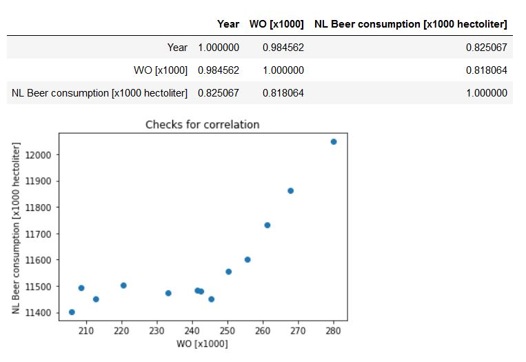

# CS Assignment

1. Create a free github account if you don't already have one.
2. Fork this repository.
3. Create a markdown (.md) named "solution_<your name>.md" file that will contain the following:
    
4. The title of the following papers pivotal to our knowledge:
  - MCC Van Dyke et al., 2019, *The Rise of Coccidioides: Forces Against the Dust Devil Unleashed* 
  - JT Harvey, Applied Ergonomics, 2002, *An analysis of the forces required to drag sheep over various surfaces*
  - DW Ziegler et al., 2005, *The neurocognitive effects of alcohol on adolescents and college students*
    
5. Create 1 plot from the dataset "istherecorrelation.csv", with DPI=300. The objective is to visualize the data as you see fit. Include the resulting image in the markdown file (and you can also write a few lines of interpretation if you like).

6. Commit and push these two files to your fork.
7. Create a pull request for me to this (original) repo. (Hint: you can use the "New pull request" button and then do a "compare across forks").
